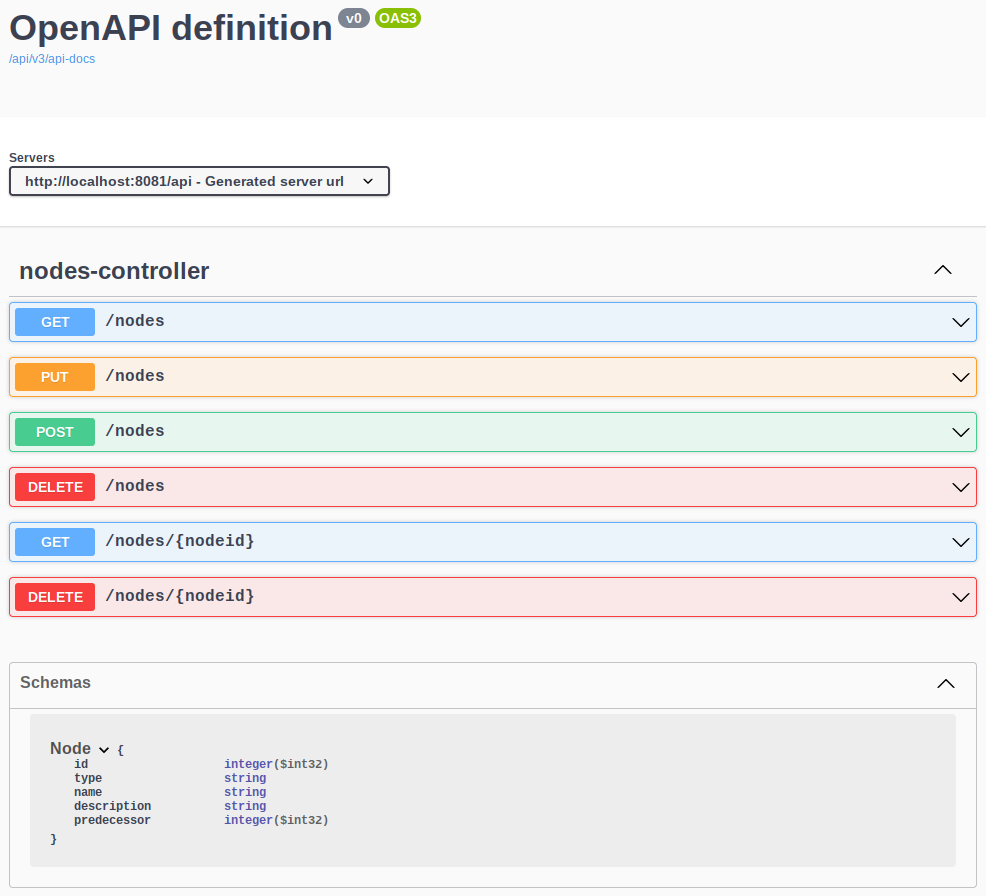

# Nodes Challenge
A little full stack project about KNIME nodes

## System requirements
* OpenJDK v11.0.13
* Node v10.19.0
* Python v3.8.8, requests v2.25.1

## How to install and start the backend
* `$ cd nodes-backend`
* `$ ./gradlew build`
* `$ java -jar build/libs/nodes-backend-0.0.1-SNAPSHOT.jar`
* Open a browser and check [http://localhost:8081/api/swagger-ui/index.html](http://localhost:8081/api/swagger-ui/index.html)
* If you see something like this, it works:

  

## How to install and start the frontend
* `$ cd nodes-frontend`
* `$ npm instal`
* `$ npm run serve`
* Open a browser and check [http://localhost:8080/](http://localhost:8080/)
* If you see something like this, it works:

  

## How to use
* You can use a Python script to populate the backend:
  ```
  $ cd nodes-backend/src/cli/python`
  $ python nodes-api-calls.py add_nodes`

  ```
* You can use the Python script to check if the import went through:
  ```
  $ python nodes-api-calls.py get_all_nodes
  ```
* Open a browser and check [http://localhost:8080/](http://localhost:8080/)
* If you see something like this, it works:

  
  
* Use the create, read, update and delete functionalities of the browser client
